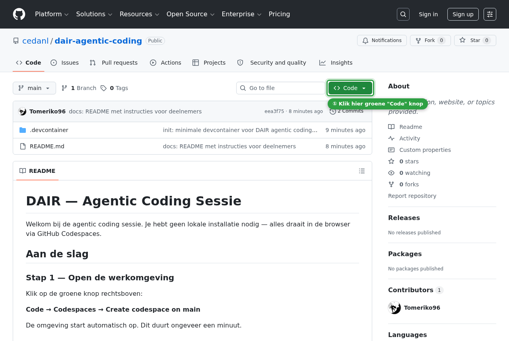
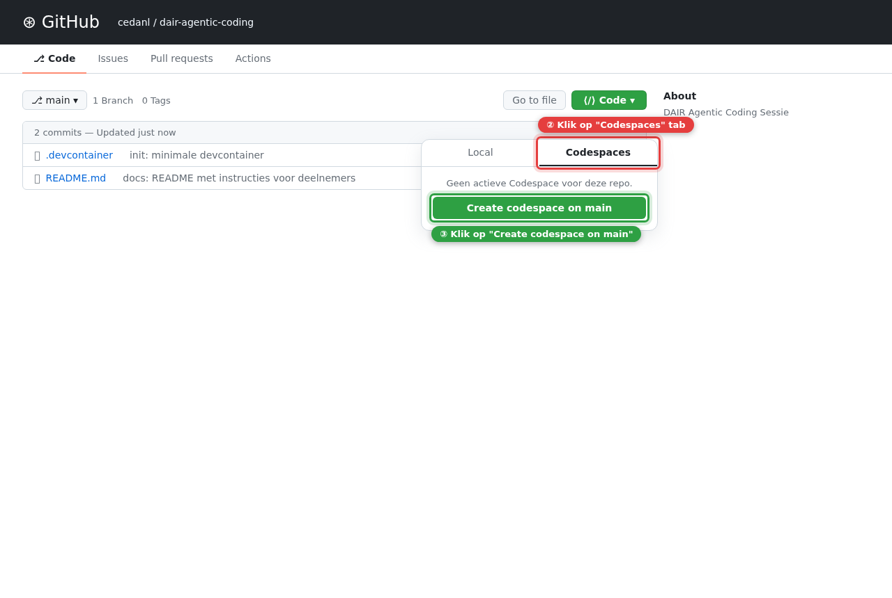
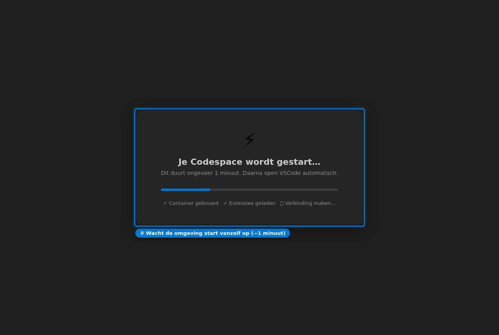
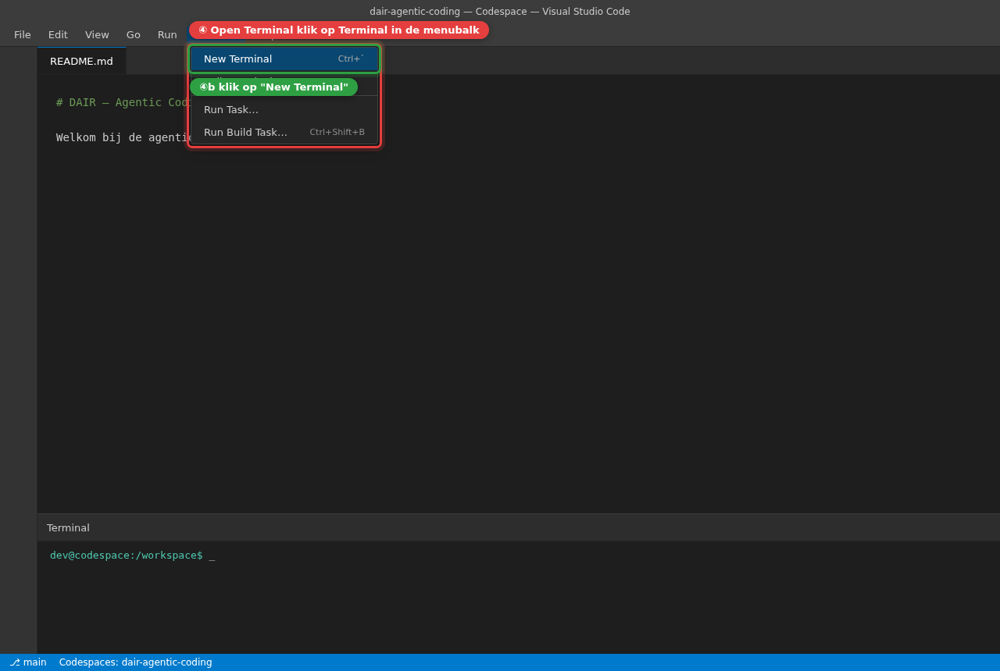
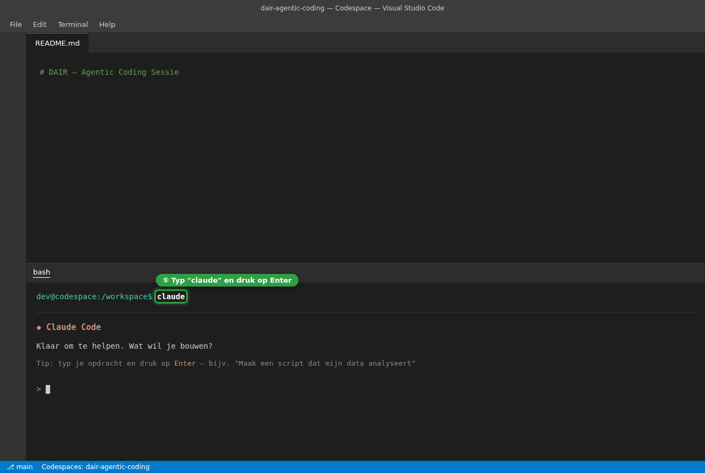

# DAIR — Agentic Coding Sessie

Welkom bij de agentic coding sessie. Je hebt geen lokale installatie nodig — alles draait in de browser via GitHub Codespaces.

---

## Aan de slag

### Stap 1 — Klik op de groene "Code" knop

Zoek de groene knop rechtsboven in deze pagina en klik erop.



---

### Stap 2 — Open de Codespaces tab en maak een Codespace aan

Klik op de tab **Codespaces** en daarna op de groene knop **Create codespace on main**.



---

### Stap 3 — Wacht tot de omgeving klaar is

De Codespace start automatisch op. Dit duurt ongeveer één minuut.



---

### Stap 4 — Open een terminal

Klik in de menubalk op **Terminal → New Terminal**.

> Sneltoets: `Ctrl+`` ` (Windows/Linux) of `Ctrl+`` ` (Mac)



---

### Stap 5 — Start Claude

Typ in de terminal het volgende commando en druk op **Enter**:

```
claude
```



Claude is nu klaar om te helpen. Typ je opdracht en druk op Enter.

---

## Hulp nodig?

Spreek een begeleider aan of stel je vraag hardop — dat is precies waar deze sessie over gaat.
