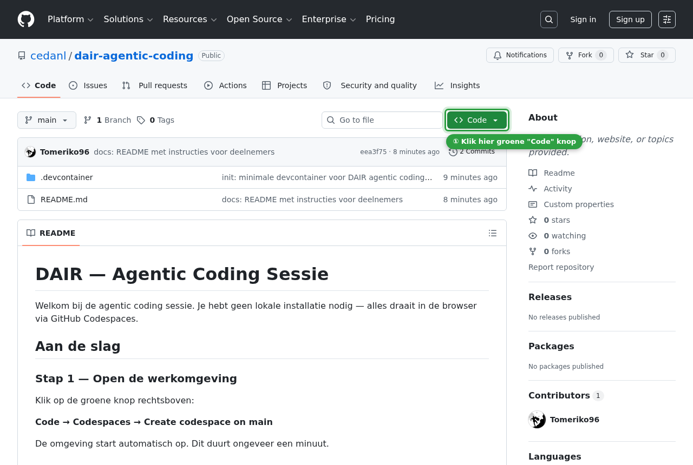
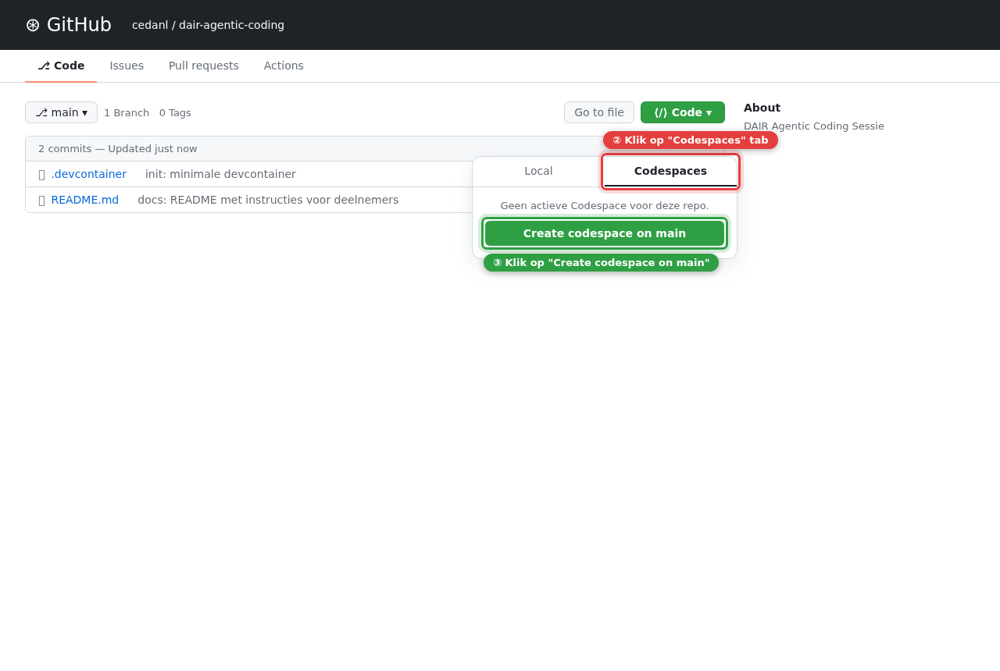
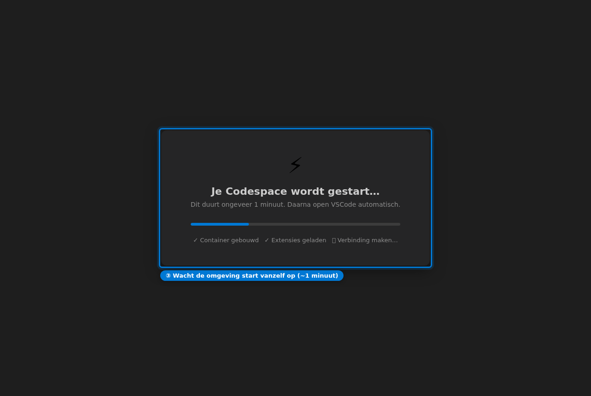
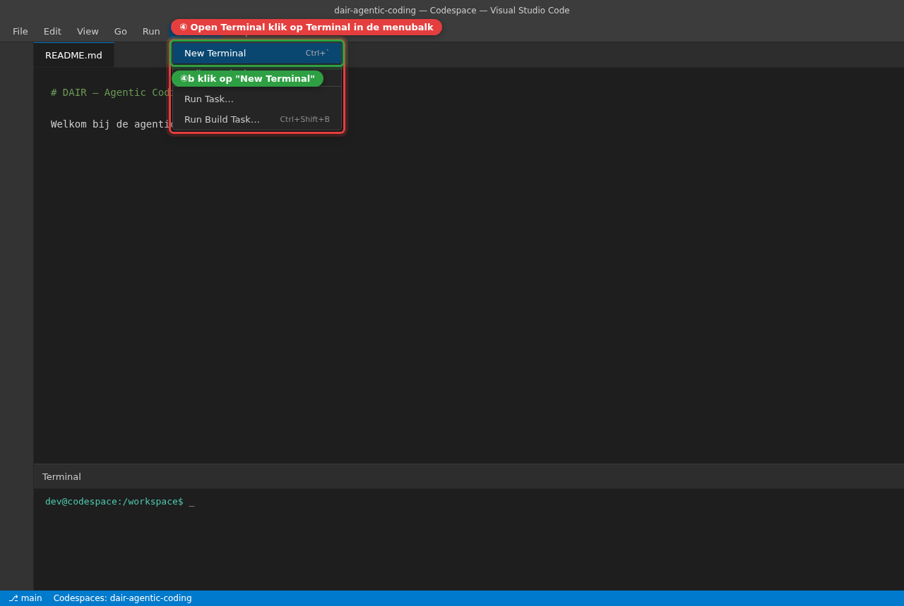
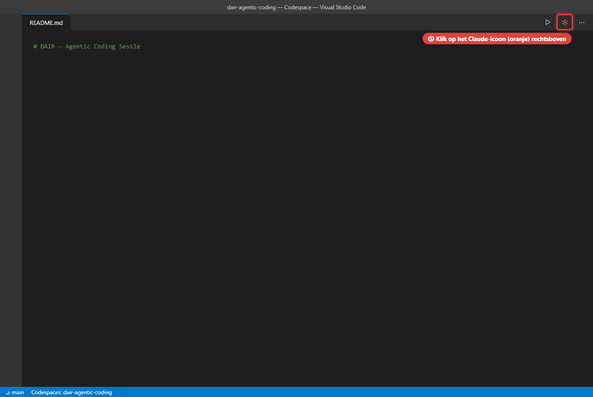
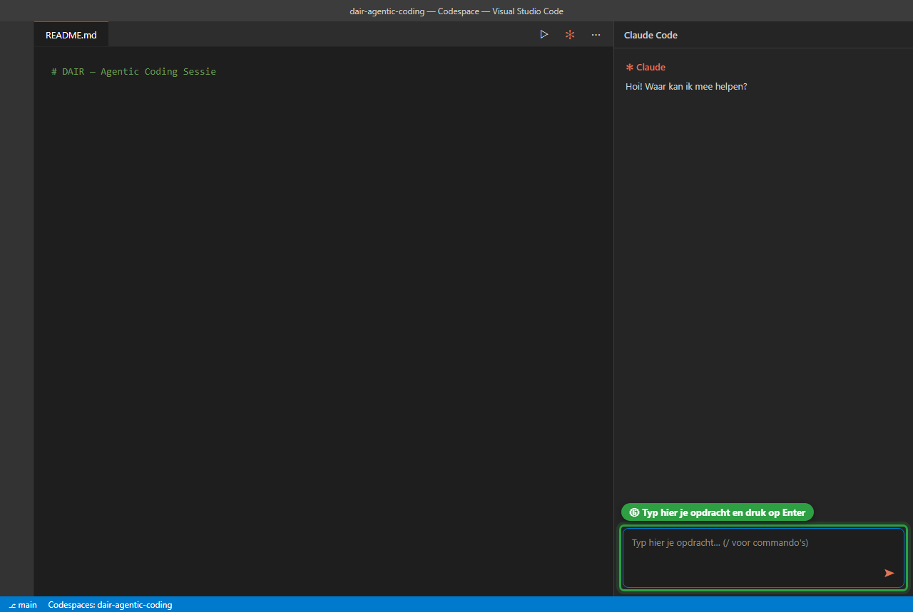

# DAIR — Agentic Coding Sessie

Welkom bij de agentic coding sessie. Je hebt geen lokale installatie nodig — alles draait in de browser via GitHub Codespaces.

---

## Aan de slag

### Stap 1 — Klik op de groene "Code" knop

Zoek de groene knop rechtsboven in deze pagina en klik erop.



---

### Stap 2 — Open de Codespaces tab en maak een Codespace aan

Klik op de tab **Codespaces** en daarna op de groene knop **Create codespace on main**.



---

### Stap 3 — Wacht tot de omgeving klaar is

De Codespace start automatisch op. Dit duurt ongeveer één minuut.



---

### Stap 4 — Voer de workshop-key in (via de terminal)

Klik in de menubalk op **Terminal → New Terminal**.

> Sneltoets: `Ctrl+`` ` (Windows/Linux) of `Ctrl+`` ` (Mac)



De eerste keer vraagt de terminal om de **workshop-key**. Die krijg je van de begeleider. Plak hem en druk op **Enter** (je ziet tijdens het plakken niets verschijnen, dat is normaal). Opnieuw instellen kan altijd met `dair-onboard`.

---

### Stap 5 — Open het Claude-paneel

Klik op het **oranje Claude-icoon** rechtsboven in de editor. Het Claude-paneel opent aan de rechterkant. Je hoeft niets in de terminal te typen.



---

### Stap 6 — Geef Claude een opdracht

Typ je opdracht in het vak onderaan het paneel en druk op **Enter**. Met `/` zie je alle beschikbare commando's en skills. Hieronder staat welke skills je in deze sessie gebruikt.



---

## De skills

Een skill is een werkwijze die Claude volgt. Je start er een met `/` en de naam. In deze sessie gebruik je er drie, achter elkaar:

| Stap | Skill | Wat Claude doet | Wat je krijgt |
|---|---|---|---|
| 1 | `/verkennen_data` | Leert samen met jou de data kennen: wat de kolommen kunnen betekenen, welke definities en privacyregels gelden, en welke ideeën er bij jouw vraag passen | `uitvoer/data-profiel.html` |
| 2 | `/schets_dashboard` | Schetst twee of drie grafieken (views) op papier, nog zonder code | `uitvoer/schets.html` |
| 3 | `/bouwen_dashboard` | Bouwt het dashboard, met een uploadscherm als eerste scherm | Een dashboard dat je zelf opent |

**Hoe het werkt.** Claude stelt je eerst een paar vragen in één bericht, elk met een standaardantwoord. Antwoord "ok" of corrigeer wat niet klopt: jij beslist over de inhoud, Claude voert uit. De uitkomsten (HTML) komen in de map `uitvoer/`; open ze in je browser.

**De data.** De demodata (fictieve studenten) staat in `data/demodata_1cho.csv`. Heb je uitleg bij de data (een codebook, een omschrijving van de kolommen, een definitie), geef die dan aan Claude wanneer `verkennen_data` daarom vraagt. Heb je dat niet, dan leidt Claude de betekenis af uit de kolomnamen en vraagt het jou om te bevestigen. De skills zelf kennen geen 1CHO en werken ook met andere data. Het dashboard laadt zelf geen data: je uploadt het bestand op het eerste scherm. In Codespaces download je het eerst (rechtsklik op het bestand in de verkenner, *Downloaden*) en upload je het daarna.

Aan het einde van de sessie sluit je af met `/review-reflect` (zie hieronder).

---

## Review geven

Aan het einde van de sessie, kies de route die voor jou werkt:

1. **Webformulier (aanbevolen).** Draai dit in de terminal en open de link in je browser:

   ```
   python3 scripts/feedback.py link
   ```

   Je kunt ook de link gebruiken die de begeleider deelt.
2. **In Claude:** typ `/review-reflect`.
3. **In de terminal, zonder Claude:** `python3 scripts/feedback.py form`

Routes 2 en 3 sturen vanuit je Codespace rechtstreeks naar voxpop. Dat lukt niet altijd (soms time-out); gebruik dan route 1.

De review is anoniem en gaat naar de begeleiders. Enter slaat een vraag over.

---

## Hulp nodig?

Spreek een begeleider aan of stel je vraag hardop, dat is precies waar deze sessie over gaat.
